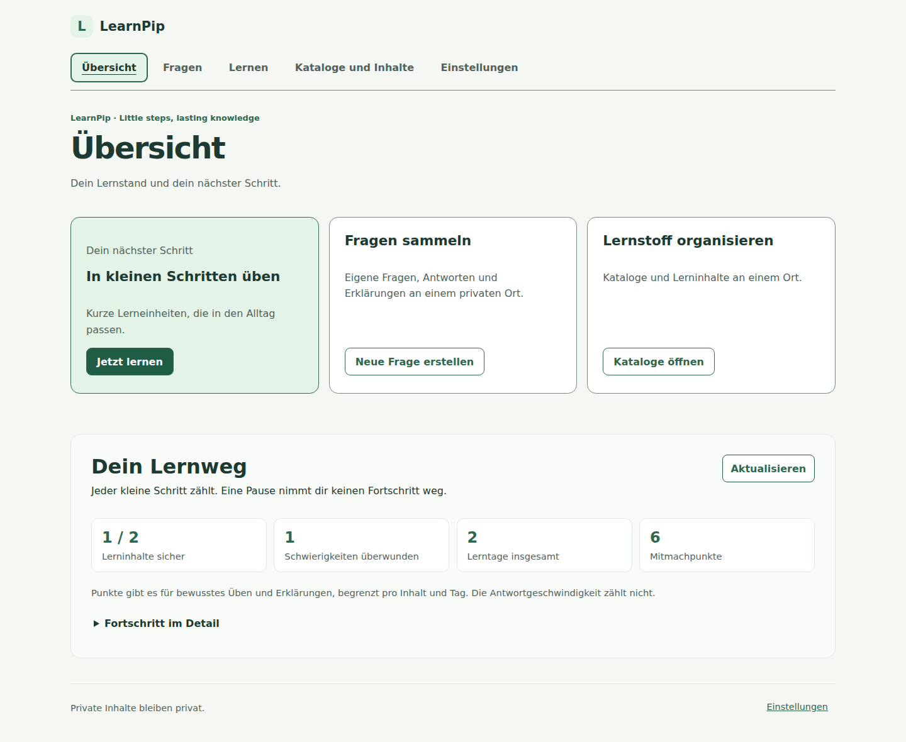

# LearnPip

**Little steps, lasting knowledge.**  
*Jeden Tag ein bisschen schlauer.*

LearnPip ist ein Open-Source-Projekt für kurze, regelmäßige Lerneinheiten. Lernende sollen eigene Fragen erstellen, in kleinen Schritten üben und ihren Fortschritt nachvollziehen können. Der Quellcode und die Entwicklung finden öffentlich in diesem Repository statt.

> **Projektstatus (3. Oktober 2026):** Backend, responsive Angular-Weboberfläche, Docker-Release-/Installationsweg und die technischen Kernfunktionen der Phasen M1 bis M5 sind vorhanden. Sichere Admin-Web-Updates aus PR #91 wurden zusammengeführt; der Betrieb benötigt einen eigens eingerichteten Host-Operator. M0 ist wegen des noch nicht juristisch freigegebenen CLA-Verfahrens nicht abgeschlossen. M6 und weitere Funktions-, Integrations-, Rechts- und Betriebsabnahmen bleiben in Arbeit. Ein vorhandener Codepfad bedeutet noch keine allgemeine Freigabe für öffentliche oder schulische Installationen.

## Ein erster Eindruck

Die Übersicht führt direkt zu kurzen Lerneinheiten und eigenen Fragen.
Die Aufnahme verwendet fiktive Beispieldaten.

Weitere Ansichten zum Bearbeiten von Fragen, zu Katalogen und zur mobilen Lerneinheit
findest du in der [Bildvorschau](docs/UI-PREVIEW.md).

## Für wen ist LearnPip gedacht?

LearnPip richtet sich an Menschen, die Schulstoff, Ausbildungsthemen oder Prüfungsinhalte in ihrem eigenen Tempo üben möchten. Neben dem persönlichen Lernbereich gibt es bereits gruppenbezogene Funktionen; spätere Erweiterungen bleiben im Issue-Tracker dokumentiert.

Der Kernablauf lautet:

1. **Frage erstellen:** Eine eigene Frage mit Antwort und Erklärung anlegen.
2. **Kurz üben:** In einer kleinen Lerneinheit Fragen beantworten und die Lösung verstehen.
3. **Fortschritt sehen:** Erkennen, was schon klappt und was noch Übung braucht.

## Verfügbare Funktionen und Grenzen

Der aktuelle Code umfasst unter anderem:

- ohne verpflichtende E-Mail-Adresse beginnen und einen Zugang wiederherstellen;
- eigene Textfragen und Bildfragen als private Inhalte anlegen;
- mit Einzel- und Mehrfachantworten üben, deren Reihenfolge variiert;
- Lösungen und Erklärungen einsehen und den eigenen Lernfortschritt verfolgen;
- die Weboberfläche auch auf einem Smartphone verwenden;
- LearnPip mit Docker Compose und PostgreSQL selbst betreiben.

Die Umsetzung enthält inzwischen optionale KI-Betriebsarten (standardmäßig `off`), Gruppen, einen moderierten Freigabeablauf und Prüfungssimulationen. Nicht jede Funktion ist damit bereits rechtlich oder betrieblich für eine öffentliche Instanz freigegeben. Aktuelle Arbeiten und offene Punkte stehen in den [GitHub-Issues](https://github.com/kennfarbe/LearnPip/issues) und [Meilensteinen](https://github.com/kennfarbe/LearnPip/milestones).

## Inhalte und Sichtbarkeit

Für private, gruppenbezogene und öffentliche Inhalte sind unterschiedliche Berechtigungswege im Code vorgesehen. Öffentliche Beiträge unterliegen Moderation und getrennten Inhaltsrechten:

| Bereich | Berechtigungsprinzip |
| --- | --- |
| Private Fragen und Fotos | Nur für die berechtigte Person sichtbar; keine automatische Veröffentlichung. |
| Geschlossene Gruppen | Nur für Mitglieder der jeweiligen Gruppe mit passender Rolle und Freigabe. |
| Öffentliche Inhalte | Nur nach ausdrücklicher Einreichung, Rechteentscheidung und Moderation. |

Die Code-Lizenz erteilt keine Rechte an hochgeladenen Aufgaben, Antworten, Erklärungen, Fotos oder anderen Nutzerinhalten. Öffentliche Inhalte benötigen eine gesonderte, verständliche Freigabe und Lizenzentscheidung.

## Technischer Ansatz

Das gemeinsame Repository enthält getrennte Projekte und Docker-Images für eine ASP.NET-Core-API auf .NET 10, einen Hintergrunddienst und ein Angular-Webfrontend. Stabile Releases veröffentlichen diese Images automatisch unter `kennfarbe/learnpip` auf Docker Hub; Produktionsinstallationen verwenden einen festen Release-Tag. PostgreSQL speichert die Daten. Zur Anmeldung gibt es unter anderem pseudonyme Konten, E-Mail-Codes und optional OpenID Connect. Die versionierte API kann später auch von einer nativen App genutzt werden.

Der technische Aufbau mit [C1-Systemkontext, C2-Containerübersicht und ADRs](docs/architecture/README.md) beschreibt die Architektur. Den lokalen Stack kannst du mit der [Entwicklungsanleitung](docs/DEVELOPMENT.md) starten; für eine veröffentlichte Version gibt es die [Installation und Aktualisierung aus einem Release](docs/RELEASE-INSTALL.md), für Proxmox die [Schritt-für-Schritt-Installation](docs/PROXMOX.md) und für den laufenden Betrieb die [Betriebsanleitung](docs/OPERATIONS.md). Das [Datenmodell und die Wiederherstellung](docs/DATABASE.md) sind ebenfalls dokumentiert. Der [API-v1-Vertrag](docs/API.md) beschreibt Endpunkte und Berechtigungen; [Konten und Identitätswege](docs/IDENTITY.md) erläutert die Anmeldung.

Die [optionalen KI-Betriebsarten](docs/AI_PROVIDERS.md) sind standardmäßig deaktiviert und beschreiben Provider, Datenweg und Kostenlimits vor einer Anfrage.

## Roadmap und tatsächlicher Umsetzungsstand

Die ursprünglichen Meilensteine beschreiben Entwicklungsschwerpunkte, nicht den Abschluss sämtlicher zugehöriger Issues. Viele Funktionen sind bereits implementiert; Sicherheits-, Rechts- und Betriebsfreigaben sind davon getrennt zu beurteilen.

| Phase | Technischer Stand am 3. Oktober 2026 | Was noch offen ist |
| --- | --- | --- |
| M0 – Projektregeln | AGPL-Lizenzgrenzen, Beitrags- und Sicherheitsdokumentation vorhanden; CLA-Entwurf erstellt. | Juristische Prüfung und wirksamer CLA-Annahme-/Prüfprozess (#3), weitere für verschiedene Betreiber nötige EU-Nachweise (#93–#103). |
| M1 – Technisches Fundament | API, Datenbank, bestehende Anmeldewege, Container, CI, Release-/Installationsweg und direkte Administrator-Ersteinrichtung vorhanden. | Zusätzliche Identitätswege (#104–#107). |
| M2 – Nutzbares MVP | Private Text-/Bildfragen, Lerneinheiten, Antworten, Erklärungen und Fortschritt implementiert. | Weiterentwicklung des portablen Imports von Katalogen und -exports (#108, #110, #115, #118). |
| M3 – Zusammenarbeit | Gruppen, öffentliche Einreichung und Wege zur Moderation vorhanden; gesonderter mit Protokollierung Zugriff für Moderatoren ergänzt. | Vollständige nach Rollen getrennte Frageaktionen und konfigurierbare Rechte (#119/#120), Community-Freigabe (#117). |
| M4 – Prüfungsvorbereitung | Lernziele, Prüfungsübungen und Simulationen technisch vorhanden. | Optionale unabhängige Lernpakete und fachspezifische Amateurfunkprüfung N/E/A (#109–#114). |
| M5 – Optionale KI | Konfigurierbare Cloud-/Lokal-/Aus-Betriebsarten und vorhandene KI-Funktionen; standardmäßig deaktiviert. | Betriebs- und vom Anwendungsfall abhängige Transparenz-/Rechtsprüfung (#102), keine pauschale Einsatzfreigabe. |
| M6 – Ausbau | Responsive/PWA-Oberfläche, Betriebsfunktionen und Admin-Web-Updates in wesentlichen Teilen vorhanden. | Weitere Zugänge, Verteilung von Katalogen und Betriebs-/Sicherheitsnachweise (#95–#107, #96/#97). |

**Updates prüfen:** Manuelle Abfragen neuer Versionen zeigen ihren Fortschritt und melden
abgelaufene Administrator-Anmeldungen, Verbindungsfehler und Zeitüberschreitungen.
Die Versionsquelle und die erneute Anmeldung sind unter
[Admin-Web-Updates](docs/admin-web-updates.md#manuell-nach-neuen-versionen-suchen) beschrieben.

**Administrator einrichten:** In einer bestehenden Installation ohne Administrator
`./scripts/setup-admin.sh` im aktuellen Release aufrufen. Benutzername und Passwort
werden interaktiv geprüft; das Passwort wird verdeckt wiederholt. Bestehende
Zugänge bleiben unverändert.
[Anleitung](docs/ADMINISTRATION.md#lokale-wiederherstellung-und-bestehende-installationen).

**Private Kataloge:** Name und optionale Beschreibung sind bearbeitbar. Eine Frage
kann mehreren Katalogen angehören; die Auswahl im Editor, in der Verwaltung und
beim Lernen berücksichtigt alle Zuordnungen. Das Löschen eines Katalogs erhält
Fragen und Lernstände. Details: [Eigene Kataloge verwalten](docs/PRIVATE-CATALOGS.md).

**Austausch von Katalogen:** Private ZIP-Importe, selektive Exporte, optionale
Pakete für die ganze Instanz und bestätigte Updates sind vorhanden. Neue Exporte
verwenden den stabilen Vertrag 1.0.0; die alten Entwürfe können weiterhin importiert
werden. Archivierte Schemas, Golden-Pakete, Migrationen mit Prüfung auf Datenverlust
und Tests zwischen Versionen und unabhängigen Instanzen sichern den
[öffentlichen Vertrag für das Format](docs/CATALOG-INTERCHANGE.md). Tatsächliche
Kataloge für die Community und ihre unabhängigen Repositories und Prüfverfahren
bleiben gesondert.

Die [offenen GitHub-Issues](https://github.com/kennfarbe/LearnPip/issues) sind die verbindliche Detailübersicht. Ein technischer Zwischenstand ersetzt weder die vollständigen Akzeptanzkriterien noch eine rechtliche oder betriebliche Abnahme.

## Open Source und Beiträge

Der **Programmcode dieses Projekts** wird unter **GNU AGPL-3.0-only** lizenziert. Die Lizenz gilt für die Software, die im Repository als Teil des Programmcodes gekennzeichnet ist. Die [Datei LICENSE](LICENSE) nennt die Lizenz und verweist auf ihren vollständigen offiziellen Text. Das AGPL-Netzwerk-Copyleft gilt nach den Bedingungen der Lizenz auch bei Nutzung einer modifizierten Version über ein Netzwerk.

Eine **optionale individuelle kommerzielle Lizenz** kann für Code angeboten werden, für den die Projektleitung die dafür nötigen Rechte besitzt. Die AGPL erlaubt auch kommerzielle Nutzung unter ihren Bedingungen; eine Firma benötigt daher nicht allein wegen entgeltlicher Nutzung eine Zweitlizenz. Der offizielle Projektcode soll weiterhin öffentlich unter AGPL verfügbar bleiben. Rechte an fremden Beiträgen können erst dann in eine zusätzliche Lizenz einbezogen werden, wenn sie ausdrücklich und wirksam eingeräumt wurden; der CLA-Prozess ist in [Issue #3](https://github.com/kennfarbe/LearnPip/issues/3) vorgesehen.

Die [Lizenzübersicht](docs/LICENSING.md) grenzt Programmcode von Dokumentation, Marke, Abhängigkeiten und Nutzerinhalten ab. Aufgaben, Antworten, Fotos und andere Nutzerinhalte werden durch die Code-Lizenz nicht automatisch an LearnPip lizenziert. Eine öffentliche Inhaltslizenz muss separat gewählt und vor einer Veröffentlichung angezeigt werden.

Du möchtest mithelfen? Sieh dir die [offenen Issues](https://github.com/kennfarbe/LearnPip/issues) an und diskutiere eine Idee dort, bevor du größere Änderungen beginnst. Bis zur rechtlichen Freigabe der CLA-Erstfassung und einer verpflichtenden, geprüften CLA-Statuskontrolle dürfen externe Codebeiträge nicht übernommen werden. Siehe [Issue #3](https://github.com/kennfarbe/LearnPip/issues/3) und [Prüfliste](docs/CLA-ROLLOUT.md). Sicherheitslücken bitte über den privaten Meldeweg in [SECURITY.md](SECURITY.md) einreichen.

## Lizenzhinweis für spätere gehostete Installationen

Das Repository enthält eine startbare Anwendung. Bei einem Netzwerkbetrieb müssen die AGPL-Pflichten und der Verweis auf den Quellcode der **tatsächlich installierten Version** berücksichtigt werden. Der Link muss zur Version passen, die der Betreiber tatsächlich einsetzt.

[Datenexport, Selbstlöschung und Missbrauchsschutz](docs/DATA-RIGHTS.md)

## Lokaler Administrator und Sicherheitsprüfung

Die Erstinstallation richtet einen Administrator mit Benutzername und Passwort ein; Updates erhalten bestehende Konten und Rollen. Anmeldung und Passwortänderung stehen unter Einstellungen bereit. Details: [Administration](docs/ADMINISTRATION.md). Unterstützte Releases, Image-Digests, wiederkehrende Audits und Freigabesperren sind unter [Sicherheit](docs/SECURITY-AUDITS.md) beschrieben.
