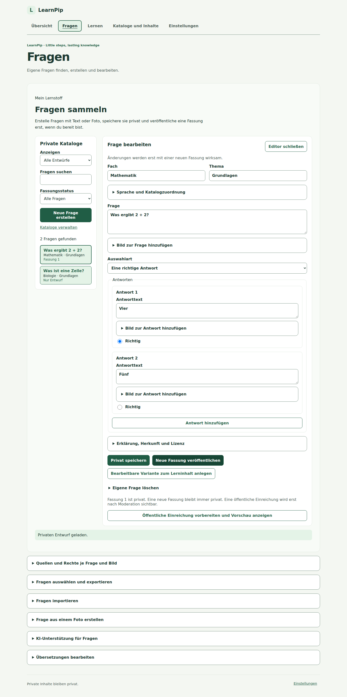
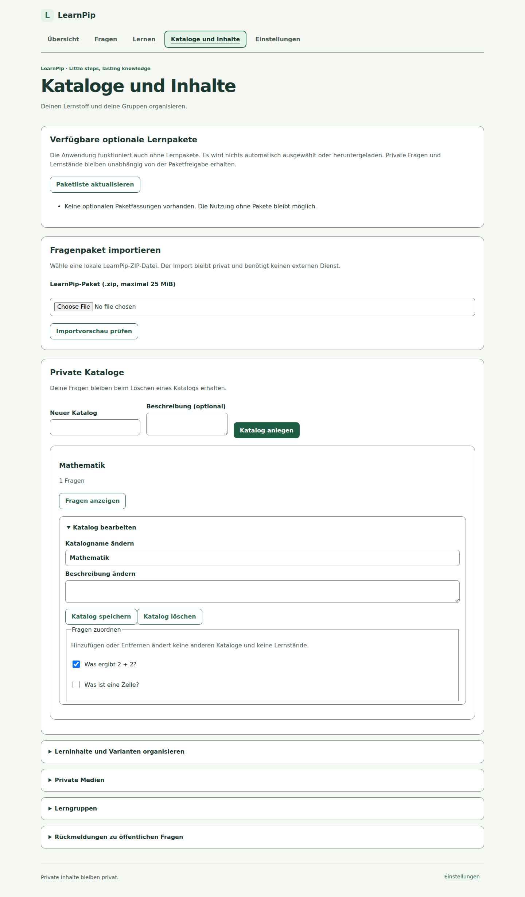
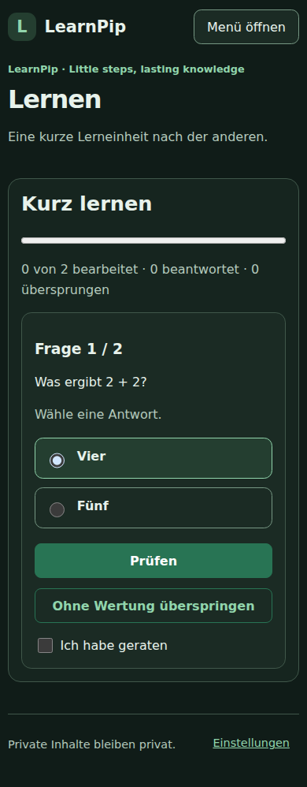
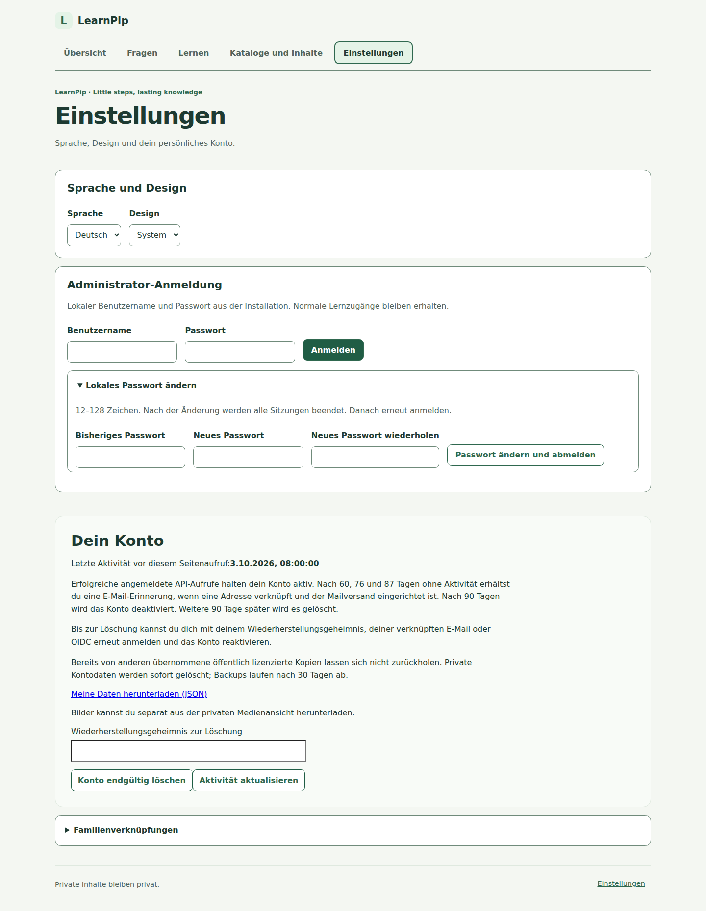

# Ein Blick auf LearnPip

Diese Bilder zeigen die echte Weboberfläche mit fiktiven Beispieldaten.
Sie enthalten keine Daten echter Benutzer. Die verfügbare Navigation hängt von
den Berechtigungen des Kontos ab.

## Übersicht

Die Startseite bietet direkte Wege zum Lernen, zu eigenen Fragen und Katalogen.
Darunter wird der persönliche Lernfortschritt zusammengefasst.


## Eigene Fragen bearbeiten

Fragen lassen sich suchen und nach Katalog oder Fassungsstatus filtern.
Der Editor zeigt die ausgewählte Frage und ihre Antwortmöglichkeiten.
Darunter liegen die aufklappbaren Bereiche für lokale Exportauswahl und Import.
Der Export bietet kombinierte Filter, eine Lizenzvorschau und einen bestätigten
ZIP-Download ohne öffentliche Veröffentlichung.



## Kataloge und Inhalte

Private Kataloge bündeln eigene Fragen. Von hier aus gelangt man direkt zur
gefilterten Fragenliste. Lokale ZIP-Fragenpakete lassen sich nach einer Vorschau
und ausdrücklicher Bestätigung in einen neuen privaten Katalog importieren.



## Lernen auf dem Smartphone

Die mobile Ansicht zeigt eine Frage nach der anderen. Das dunkle Design kann
in den Einstellungen gewählt werden.



## Bilder aktuell halten

Die Bilder werden aus dem Produktionsbuild mit isolierten Beispieldaten erzeugt.
Nach Änderungen an Oberfläche, Texten, Assets oder Build-Abhängigkeiten:

```sh
cd frontend/web
npm ci
npx --no-install playwright install --with-deps chromium
npm run docs:screenshots
npm run docs:screenshots:check
```

Alle fünf Bilder und `docs/screenshots/manifest.json` zusammen einchecken und
visuell prüfen. Bei geänderten Bildinhalten auch die Alternativtexte aktualisieren.
Die CI prüft die Fingerabdrücke der UI-Quellen und Bilddateien und schlägt bei
veralteten Aufnahmen fehl. Sie ersetzt keine visuelle Prüfung der Bilder.

## Lokaler Administratorzugang


