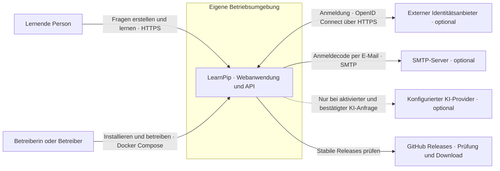

# C1 – Systemkontext

Stand: 2. Oktober 2026 · [C2 – Container](C2-containers.md)

LearnPip ist eine selbst betreibbare Anwendung für private Fragen und kurze
Lernsitzungen. Die C1-Sicht zeigt die Systemgrenze einer Installation und ihre
Beziehungen zu Menschen und externen Diensten.

| Gegenüber | Beziehung zu LearnPip |
| --- | --- |
| Lernende Person | Nutzt die Weboberfläche für private Entwürfe, Fragen und kurze Lernsitzungen. |
| Betreiberin oder Betreiber | Installiert und aktualisiert die Instanz und konfiguriert Datenbank, Geheimnisse und optionale Dienste. |
| Externer Identitätsanbieter | Nur bei konfiguriertem OIDC: Anmeldung und Rückruf an die API. |
| SMTP-Server | Nur bei konfiguriertem Mailtransport: Die API versendet Anmeldecodes. |
| Optionaler KI-Provider | Nur bei konfigurierter Betriebsart und ausdrücklich bestätigter Anfrage; standardmäßig deaktiviert. |
| GitHub Releases | Quelle der stabilen Veröffentlichungen für Prüfung, Installation und geplante Admin-Web-Updates. |

**Systemgrenze:** Weboberfläche, API, Worker, Proxy und Datenbank gehören zur
LearnPip-Installation und erscheinen hier als ein System. Die Datenbank ist
kein externer Dienst dieser Sicht. OIDC und SMTP sind optional.

**Umfang:** Die Sicht beschreibt den implementierten Stand. Native Apps sind weiterhin geplant. Gruppen, Moderation und optionale KI-Betriebsarten sind technisch vorhanden; der gesonderte Host-Update-Operator befindet sich in PR #91 und erfordert eine eigene Installation. Siehe [API](../API.md), [Identität](../IDENTITY.md), [optionale KI](../AI_PROVIDERS.md), [Betrieb](../OPERATIONS.md) und [Admin-Updates](../admin-web-updates.md).
