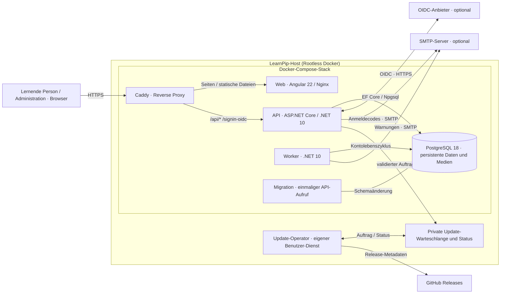

# C2 – Container und Update-Operator

Stand: 2. Oktober 2026 · [C1 – Systemkontext](C1-system-context.md)

Diese Sicht zeigt den Produktions-Stack aus [`deploy/compose.prod.yaml`](../../deploy/compose.prod.yaml) einschließlich der Update-Integration aus dem noch offenen PR #91. Der lokale Entwicklungs-Stack verwendet dieselben Kernteile mit lokal gebundenen Ports.

| Komponente | Verantwortung | Zugriff und Persistenz |
| --- | --- | --- |
| Caddy (`proxy`) | TLS und Weiterleitung an API bzw. Web | Standardports 80/443, keine Anwendungsdaten |
| Web (`web`) | Responsive Angular-Oberfläche und PWA | API-Aufruf durch Browser über dieselbe Herkunft |
| API (`api`) | Anmeldung, Berechtigungen, Fragen, Medien, Lernfunktionen und Update-Auftragsannahme | Datenbank sowie eng begrenzter Queue-Schreib- und Status-Lesezugriff; kein Docker-Socket |
| PostgreSQL (`db`) | Konten, private Inhalte und Bilddaten | Persistentes Volume, keine öffentlichen Datenbankports |
| Worker (`worker`) | Kontoinaktivität, Warnungen und geplante Arbeiten | Interne Datenbankverbindung, optional SMTP |
| Migration (`migrate`) | Schemaänderungen vor Inbetriebnahme | Einmaliger Job |
| Update-Operator (außerhalb von Compose) | Geprüftes Release als Rootless-Docker-Benutzer aktualisieren | Private Warteschlange/Status im gemeinsamen Host-Verzeichnis |

Der Webcontainer greift nicht selbst serverseitig auf die API zu; JavaScript im Browser verwendet den Reverse Proxy. Das Produktionsnetzwerk trennt `frontend` und `private`. API und Operator besitzen **keine gemeinsame Shell- oder Docker-Socket-Berechtigung**. Der Operator erfordert eine gesonderte Host-Einrichtung; PR #91 allein aktiviert keine produktive Installation. Siehe [Update-Architektur](../admin-web-updates.md), [Betrieb](../OPERATIONS.md) und [Datenbank](../DATABASE.md).
