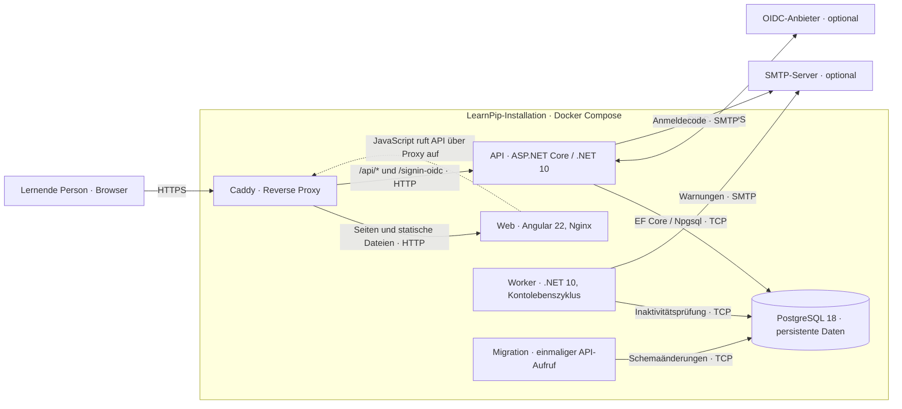

# C2 – Container

Stand: 29. September 2026 · [C1 – Systemkontext](C1-system-context.md)

Die C2-Sicht zerlegt eine LearnPip-Installation in separat startbare
Anwendungsteile und Datenspeicher. Sie zeigt das Produktions-Setup aus
[`deploy/compose.prod.yaml`](../../deploy/compose.prod.yaml). Der lokale
Compose-Stack verwendet dieselben Kernteile, aber Entwicklungsports auf
`127.0.0.1`.

| Container | Verantwortung | Persistenz und Erreichbarkeit |
| --- | --- | --- |
| Caddy (`proxy`) | TLS-Einstieg und Weiterleitung von `/api/*` und `/signin-oidc` an die API, sonst an Web. | Öffentliche Ports 80/443; keine Anwendungsdaten. |
| Web (`web`) | Angular-Oberfläche; Nginx liefert die gebauten Dateien aus. | Browser ruft die API über dieselbe Herkunft auf; kein eigener Datenbankzugang. |
| API (`api`) | Authentifizierung, Berechtigungen, Fragen, Medien, Kataloge, Lernsitzungen und HTTP-Verträge. | Liest und schreibt PostgreSQL; optionale OIDC-/SMTP-Verbindungen. |
| PostgreSQL (`db`) | Konten, private Inhalte, Medien und Lernverlauf. | Persistentes Volume, produktiv nur im internen Netzwerk. Bilder liegen derzeit als `MediaBlob` in PostgreSQL. |
| Worker (`worker`) | Prüft täglich Aktivität, versendet Warnungen, deaktiviert und löscht abgelaufene Konten. | Datenbankverbindung und optional SMTP; Heartbeat-Healthcheck. |
| Migration (`migrate`) | Führt EF-Core-Migrationen vor Inbetriebnahme aus. | Einmaliger Betriebsjob, kein dauerhaft laufender Dienst. |

Die gestrichelte Linie beschreibt den API-Aufruf durch JavaScript im Browser;
der Webcontainer ruft die API nicht serverseitig auf. In Produktion trennen
die Compose-Netzwerke `frontend` (Proxy, Web, API, Worker) und `private` (API, Worker,
Migration, Datenbank) die Teile. Der Worker nutzt die private Datenbankverbindung
und ausgehend SMTP über `frontend`. Die Datenbank hat dort keinen
öffentlichen Port; lokal bindet der Entwicklungsport nur an `127.0.0.1`.

Siehe [Betrieb](../OPERATIONS.md) für Konfiguration und Migrationsablauf sowie
[Datenbank](../DATABASE.md) für die gespeicherten Inhalte.
