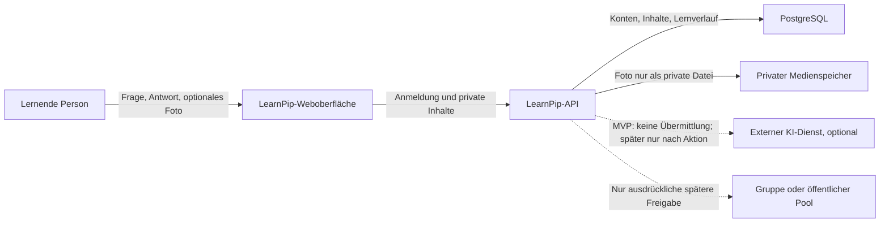

# Datenschutz- und Inhaltskonzept

**Status:** Architekturgrundlage für ein noch nicht implementiertes Produkt. Dieses Dokument ist keine Datenschutzerklärung und trifft keine abschließenden rechtlichen Feststellungen. Entscheidungen mit offenen rechtlichen oder betrieblichen Voraussetzungen sind als **OFFEN** markiert.

## Leitlinien

- LearnPip erhebt nur Daten, die für den jeweils aktivierten Lernablauf gebraucht werden.
- Lerninhalte, Antworten, Lernverläufe und Fotos sind standardmäßig privat. Es gibt keine automatische Veröffentlichung oder Weitergabe.
- Eine Freigabe an eine Gruppe oder an einen öffentlichen Fragenpool muss eine bewusste, verständliche Aktion der Person mit den nötigen Rechten sein. Der Umfang und die Zielgruppe müssen vor der Freigabe sichtbar sein.
- Die Softwarelizenz für Programmcode gilt nicht automatisch für Fragen, Erklärungen, Fotos oder andere Inhalte. Eine Inhaltslizenz und jede öffentliche Freigabe werden getrennt behandelt; siehe [Lizenzübersicht](../LICENSING.md).
- Ein KI-Dienst ist im MVP nicht vorgesehen. Später darf eine Übermittlung erst nach einer bewussten Aktion mit Anzeige des Anbieters, der betroffenen Inhalte und des Zwecks erfolgen. **OFFEN:** Anbieter, Rechtsgrundlage, Auftragsverarbeitung, Speicherfristen beim Anbieter und Opt-out-Verhalten.
- Sicherheits- und Betriebsprotokolle enthalten keine Antworttexte, Bildinhalte, Passwörter, Tokens oder vollständigen Anfragekörper.

## Geplante Datenarten und Aufbewahrung

Fristen sind Vorschläge für das Produktdesign, keine bereits beschlossene Rechts- oder Aufbewahrungsrichtlinie. Vor einem öffentlichen Betrieb müssen sie festgelegt und technisch umgesetzt werden.

| Datenart | Zweck | Speicherort | Vorgesehene Aufbewahrung und Löschung |
| --- | --- | --- | --- |
| Zugang und Kontoeinstellungen | Zugang wiederherstellen und Einstellungen speichern | PostgreSQL; Identitätsanbieter nur bei gewählter Anmeldung | Inaktive Konten werden nach 90 Tagen deaktiviert und nach weiteren 90 Tagen gelöscht; lokale Sicherungskopien laufen nach 30 Tagen aus. Wiederherstellung ohne E-Mail ist mit dem einmaligen Wiederherstellungsgeheimnis möglich. |
| Fragen, Antworten und Erklärungen | Persönliche Lerninhalte bereitstellen | PostgreSQL | Bis die Person sie löscht oder das Konto gelöscht wird. Änderungen sollen nachvollziehbare Versionen nur so lange behalten, wie die Lernfunktion sie benötigt. **OFFEN:** genaue Versionsfrist. |
| Fotos und andere Medien | Bildfragen und Inhalte anzeigen | Private `MediaBlobs` in PostgreSQL | Zusammen mit dem zugehörigen Konto löschen; keine öffentliche URL. Lokale Datenbanksicherungen laufen nach 30 Tagen aus. |
| Lernversuche und Fortschritt | Wiederholung und Fortschrittsanzeige | PostgreSQL | Bis die Person Verlauf oder Konto löscht. Export muss vor Löschung verfügbar sein. **OFFEN:** ob gelöschte Verläufe anonymisiert aufbewahrt werden dürfen. |
| Gruppenmitgliedschaften und Rollen | Zugriff auf ausdrücklich freigegebene Gruppeninhalte | PostgreSQL | Bis Austritt, Entfernung oder Gruppenlöschung; Gruppenfreigaben enden mit dem Zugriff. **OFFEN:** Aufbewahrung bei Gruppenende. Gruppen sind nicht Teil des MVP. |
| Technische Sicherheitsereignisse | Missbrauch erkennen und Dienst schützen | Begrenzte Betriebsprotokolle | Kürzeste notwendige Frist, danach löschen oder aggregieren. **OFFEN:** konkrete Frist und Zugriffskreis. |
| Inhalte für externe KI | Nur für eine von der Person gestartete KI-Funktion | Erst nach separater Freigabe an einen noch zu bestimmenden Anbieter | Keine Übertragung im MVP. Vor Umsetzung müssen Zweck, Inhalt, Anbieter, Rechtsgrundlage und Anbieterfrist geklärt sein. |

## Rollen und Sichtbarkeit

| Rolle | Eigene private Inhalte | Gruppeninhalte | Öffentliche Inhalte | Verwaltung |
| --- | --- | --- | --- | --- |
| Lernende Person | Lesen, erstellen, bearbeiten, exportieren und löschen | Nur in Gruppen, in denen sie Mitglied ist, und nur im freigegebenen Umfang | Nur Inhalte, die ausdrücklich öffentlich freigegeben wurden | Kein Zugriff auf fremde Konten |
| Gruppenverantwortliche Person (später) | Eigene Inhalte wie Lernende | Nur nach Gruppenrolle und dokumentierter Freigabe | Keine automatische Veröffentlichung aus einer Gruppe | Gruppenmitglieder und Gruppeninhalte im vereinbarten Umfang verwalten |
| Weitere Gruppenmitglieder (später) | Keine fremden privaten Inhalte | Nur ausdrücklich geteilte Gruppeninhalte | Keine automatische Veröffentlichung | Keine Konten- oder Systemverwaltung |
| Systemadministration | Kein regulärer Zugriff auf Lerninhalte | Kein regulärer Zugriff auf Lerninhalte | Nur technische Moderation nach festzulegendem Verfahren | Technischen Betrieb; privilegierter Zugriff muss begrenzt und protokolliert sein |
| Eltern oder Sorgeberechtigte | Kein automatischer Zugriff auf ein Lernkonto | Kein automatischer Zugriff | Kein automatischer Zugriff | **OFFEN:** altersgerechter Kontozugang, Nachweis und Umfang eines möglichen Elternzugriffs müssen vor dem Betrieb mit Minderjährigen entschieden werden. |

Die erste nutzbare Version ist für persönliche Nutzung ausgelegt. Gruppen, öffentliche Fragenkataloge und Elternzugänge sind spätere Ausbaustufen und erhalten erst nach eigener Rollen- und Freigabeprüfung Zugriff.

## Datenfluss

Gepunktete Verbindungen sind nicht Bestandteil des MVP. Beim MVP bleiben Fotos im privaten Speicherbereich und sind nur über eine autorisierte API-Antwort abrufbar. Dateinamen, IDs und URLs dürfen keinen öffentlichen Zugriff ermöglichen. Vorschaubilder oder abgeleitete Dateien übernehmen dieselbe Sichtbarkeit wie das Original.

## Export und Löschung

- Die betroffene Person soll ihre Kontodaten, eigenen Lerninhalte und Lernverläufe in einem maschinenlesbaren Export herunterladen können.
- Löschung muss abhängige Datensätze und Mediendateien berücksichtigen, einschließlich Vorschaubildern und Suchindizes, sofern sie eingeführt werden.
- Geteilte Inhalte dürfen nach Austritt oder Widerruf nicht weiter über Gruppenberechtigungen erreichbar sein. Bereits von anderen exportierte Kopien lassen sich technisch nicht zurückholen; dieser Umstand muss vor einer Freigabe verständlich erklärt werden.
- Wiederherstellung aus Sicherungen ist nur für den Betrieb vorgesehen. Vor Freigabe der API läuft der Kontolebenszyklus einmalig erneut; lokale Dumps werden nach 30 Tagen entfernt. Externe Kopien müssen dieselbe Frist einhalten.
- Aufbewahrungspflichten, die einer sofortigen Löschung entgegenstehen könnten, müssen vor dem Betrieb fachlich und rechtlich geprüft werden.

## Minderjährige und Sorgeberechtigte

LearnPip kann für schulische Lerninhalte und damit auch für Minderjährige verwendet werden. Es wird deshalb keine Altersgrenze, Einwilligungsgrundlage oder elterliche Zugriffsbefugnis durch dieses Konzept vorweggenommen.

**OFFENE Entscheidungen vor einem Betrieb mit Minderjährigen:** Mindestalter und altersgerechte Gestaltung; erforderliche Information und Einwilligung; Rolle und Nachweis von Sorgeberechtigten; ob ein Elternzugang angeboten wird; wie Lernende vertrauliche persönliche Inhalte schützen können; sowie die jeweils geltenden rechtlichen Anforderungen je Betriebsregion. Bis diese Punkte entschieden sind, wird kein Elternzugriff auf private Inhalte implementiert.

## Gruppen, öffentliche Inhalte und Inhaltsrechte

- Neue Fragen und Fotos sind privat.
- Eine Gruppenfreigabe ist auf die ausgewählte Gruppe begrenzt und muss widerrufbar sein, soweit keine Kopie bereits außerhalb von LearnPip erstellt wurde.
- Eine Veröffentlichung in einem öffentlichen Fragenpool erfordert eine separate Bestätigung der Sichtbarkeit und eine eigene Inhaltslizenz. Die Person muss angeben können, dass sie die erforderlichen Rechte besitzt.
- Eine Freigabe darf keine privaten Fotos oder Inhalte anderer Personen einschließen, ohne dass die nötigen Rechte und Einwilligungen geprüft wurden.
- **OFFEN:** konkrete öffentliche Inhaltslizenz, Moderationsprozess, Rechteklärung bei Minderjährigen und Verfahren für Beanstandungen.

## Offene Entscheidungen vor öffentlichem Betrieb

1. Verantwortlicher, Rechtsgrundlagen, Auftragsverarbeitung und Informationen für betroffene Personen.
2. Altersgrenzen, Einwilligung und möglicher Zugang für Sorgeberechtigte.
3. Konkrete Fristen für Konten, Versionen, Lernverläufe, Protokolle, Medien und Sicherungen.
4. Region, Verschlüsselungs- und Schlüsselverwaltung, Sicherungsziel sowie Wiederherstellungstests.
5. Exportformat und Abschlussverhalten bei Konto- und Gruppenlöschung.
6. KI-Anbieter und Übermittlungsregeln vor Aktivierung irgendeiner KI-Funktion.
7. Öffentliche Inhaltslizenz, Moderation und Widerrufs- beziehungsweise Beschwerdeprozess.

Diese Liste ist ein Architektur-Backlog und keine Rechtsberatung. Die Punkte müssen vor dem jeweiligen Produktumfang entschieden werden; optionale Gruppen-, öffentliche und KI-Funktionen bleiben bis dahin deaktiviert.
